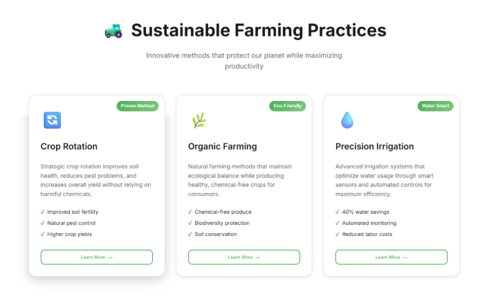

---

## 📸 Website Preview

| Home Page | Importance             | Methods                 | Contact       |
|-----------|------------------------|--------------------------|---------------|
|  |   |  |  |

---

## 🛠️ How to Use

1. 📥 Download or clone the repository  
2. 🖼️ Replace the images inside the `images/` folder with your own  
3. ✏️ Edit text in `index.html` as needed  
4. 🚀 Push changes to GitHub – it will go live automatically via GitHub Pages  

---

## 👩‍💻 Made By

Built with 💡 innovation, 🌿 love for agriculture, and ✨ creativity by [@priya1234-web](https://github.com/priya1234-web)

🚀 Open to feedback, ideas, and contributions from awesome people like you!  
Let’s grow this project together and make tech work for our farms 🌱💻🌍
